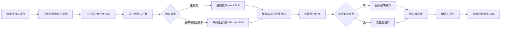

# 后台 Skill 调用逻辑说明

## 目标

将需求页的结构化字段、已授权参考图和设计师确认结果，稳定转换为可追溯的主视觉 Prompt 与图片生成任务。Skill 只负责方案和 Prompt 规划；结构化字段与硬性约束由服务端在 Skill 返回后再次强制写入，不能被 Skill 覆盖。

## 当前调用链

## 1. 需求与参考图入库

- 页面提交到项目接口后，保存正式文案、画幅、主色/辅助色、背景、主体、卖点和右侧画布的拖拽坐标。主标题、副标题、卖点区与主体的位置以拖拽坐标为准。
- 每张参考图保留用途：`整体风格`、`版面位置`、`主体形象`、`色彩参考`；同一用途允许重复，最多 8 张。
- IP / 真人参考图与普通风格图分开保存。前者在后续 Prompt 中具有最高优先级，只继承人物身份特征；后者只继承配色、构图和图形语言。

## 2. 主视觉方案完善 Skill

接口：`POST /api/agent/proposal`

调用：`proposalSkill`，通过 `callChatJson()` 请求 `CCPROXY_BASE_URL/v1/chat/completions`。

输入：

- 压缩后的需求字段。
- 用户选择的参考图及其用途。
- 基础业务规则，例如低年级画面保持明亮、清晰，参考图不复制旧文案。

输出 JSON：`summary`、`designGoal`、`informationHierarchy`、`palette`、`coreElements`、`layout`、`executableConstraints`、`referenceAnalysis`、`risks`、`questions`。

快速模式 `fast=true` 不调用模型，使用 `quickProposal()` 建立本地方案上下文；正常模式才调用方案 Skill。方案会连同需求快照和参考图 ID 保存，供下一步确认和追溯。

## 3. Prompt Skill

接口：`POST /api/agent/prompt`

选择规则：

- `materialType=主视觉`：调用 `promptSkill`。
- 其他物料：调用 `materialPromptSkill`，要求继承系列气质，但重新组织版式，且视觉等级不超过主书。

Skill 输入包含：

- 已确认方案、当前物料类型、设计师本轮修改项、父级已确认图与历史反馈。
- 主标题、副标题、年级标签和每条卖点的原文。
- 画幅、标题风格/字重/走势、配色、营销感、主体类型、常用封面元素、背景与卖点样式等视觉字段，以及主标题、副标题、卖点区和主体的归一化拖拽坐标。
- 参考图元数据及用途说明。参考优先级为：IP 参考、主体形象、版面位置、整体风格、色彩参考。
- 最多 8 张压缩视觉参考图。

Skill 输出 JSON：`positivePrompt`、`negativePrompt`、`size`、`titleText`、`keepItems`、`changeItems`、`referenceInstructions`。

## 4. 服务端强制模块

Skill 返回后，服务端的 `promptModules()` 和 `appendPromptModules()` 会再次追加以下内容：

1. 已确认文案模块：所有标题、副标题、年级标签、卖点必须逐字准确，只能换行。
2. 视觉与版式模块：画幅、视觉方向、营销感、字体、主色/辅助色、主体风格、占比。
3. 硬性构图与组件约束：右侧画布拖拽坐标是主标题、副标题、卖点区与主体的最高优先级位置依据，四者不可重叠；背景分区位置；卖点样式、数量和排布。旧构图模板仅在没有拖拽坐标的历史项目中回退使用。
4. 基础质量约束和负向约束：禁止错字、额外文字、Logo、认证徽章、低清晰度、复杂背景、未授权人物、主体遮挡标题等。
5. 角色 / IP 约束：IP 或真人参考图只可作为同一角色或同一人物的外形、服装、姿态、表情依据。

当辅助色选择“自动推荐最佳配色”时，服务端明确写入：以主色为依据选择高对比且协调的辅助色。显式选择白色、香槟金、金属银等则按该颜色执行。

营销感为独立字段：`无 / 弱 / 中 / 强`。它只提升标题、卖点、对比和视觉动势的程度，不改变已确认的文字，也禁止自动生成价格、折扣、限时、倒计时、赠品、认证徽章或额外文案。

常用封面元素为单选轻量装饰：`翻页书页`、`信封信笺`、`旅行行李箱`、`胶片播放`、`车票票券`、`展开画卷`。它们只能作为主题辅助，必须避让文字、主体面部与卖点，且不得生成额外文字、数字、Logo 或认证徽章。

## 5. 图片生成任务

接口：`POST /api/image-jobs`

任务入队后按顺序执行：

- 有参考图或父级确认图：调用 `/images/edits`，将参考图作为 `image[]` 传给图片模型。
- 无参考图：调用 `/images/generations`，只传最终正向 Prompt。
- 默认图片模型为 `gpt-image-2`，可由 `CCPROXY_IMAGE_MODEL` 覆盖。
- 图片服务容量不足时，会按递增等待时间自动重试；完成后统一缩放到当前画幅的导出尺寸，保存为候选版本。

生成前会再次补齐硬性构图模块，避免历史 Prompt 在新规则上线后遗漏当前的文案、构图或卖点约束。

## 6. 主视觉确认后的 Skill

确认主视觉时调用 `styleProfileSkill`，输入为已确认主视觉图片和其最终 Prompt。

输出为可编辑的风格规则：`palette`、`titleTone`、`coreElements`、`spacing`、`avoid`。该规则用于主书、练习册等后续物料保持系列一致性。

## 当前需要确认的边界

- 正式文案目前仍要求图片模型生成；服务端已经以正向和负向 Prompt 约束逐字准确，但尚未实现“模型出图后再用排版引擎覆盖正式文字”的确定性文字渲染。
- 徽章和 Logo 已明确禁止模型生成，并保存了位置、尺寸和素材设置；当前 `server.mjs` 尚未包含将徽章位图合成到最终图片的后处理代码。若要真正“系统后置叠加”，下一步需要增加图片合成步骤。
- 参考图上限已扩展为 8 张。是否全部传入最终图片编辑接口，取决于当前服务商对多图编辑的实际限制；后端已按最多 8 张组织请求。

## 关键代码位置

- [server.mjs](/Users/zyb/Documents/造品平台/需求提交预检原型/server.mjs:359)：通用 `callChatJson()`。
- [server.mjs](/Users/zyb/Documents/造品平台/需求提交预检原型/server.mjs:401)：三个 Prompt / 方案 Skill 的系统规则。
- [server.mjs](/Users/zyb/Documents/造品平台/需求提交预检原型/server.mjs:492)：构图和卖点的硬性约束。
- [server.mjs](/Users/zyb/Documents/造品平台/需求提交预检原型/server.mjs:1044)：方案与 Prompt 接口。
- [server.mjs](/Users/zyb/Documents/造品平台/需求提交预检原型/server.mjs:750)：图片任务执行与重试。
